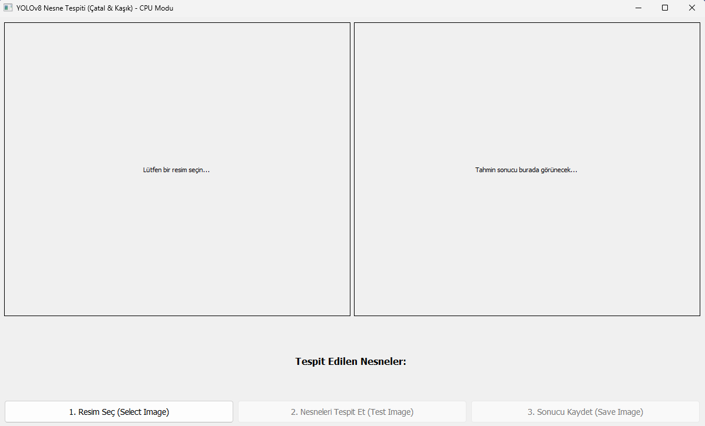
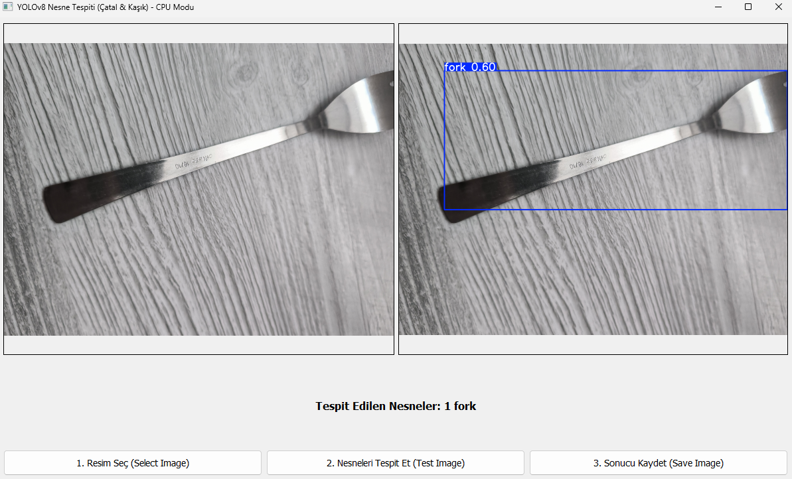
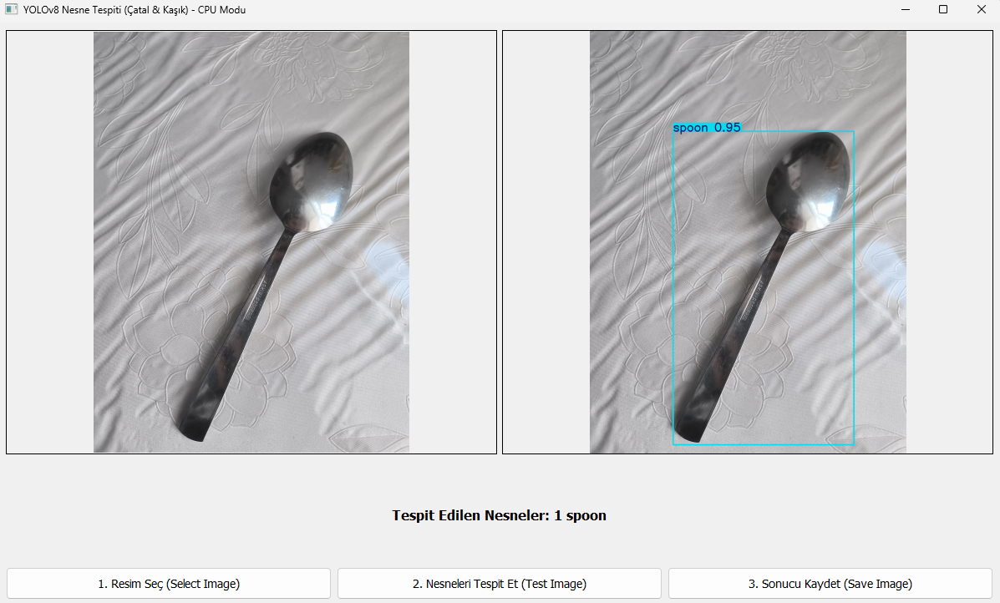

# BLG-407 Proje 2: YOLOv8 ile Çatal/Kaşık Tespiti ve PyQt5 Arayüzü

Bu proje, BLG-407 Makine Öğrenmesi dersi kapsamında, "çatal" (fork) ve "kaşık" (spoon) sınıflarını içeren özel bir veri setiyle YOLOv8 nesne tespiti modeli eğitmeyi ve bu modeli PyQt5 masaüstü arayüzü ile kullanmayı amaçlar.

## Proje Bileşenleri

- **Veri Seti**: `dataset/` — 370+ adet çatal ve kaşık fotoğrafı. Etiketleme Roboflow ile manuel yapılmıştır.
- **Eğitim**: `yolo_training.ipynb` — YOLOv8n modelinin bu veri seti üzerinde eğitilmesi adımlarını anlatır.
- **Model**: `best.pt` — Eğitim sonucunda elde edilen, mAP başarımı %90.2 olan ağırlık dosyası.
- **Arayüz**: `gui_app.py` — Resim yükleme, tespit çalıştırma ve sonuçları kutucuklar ile görüntüleme için PyQt5 tabanlı uygulama.

## Model Performansı

YOLOv8n mimarisi, CPU üzerinde 50 epoch eğitildi (≈1.25 saat). Elde edilen metrikler:

- **mAP50-95**: %90.2
- **mAP50**: %99.3
- **Precision**: %99.8
- **Recall**: %97.2

## Kurulum (Windows - Lokal)

Bu proje, PyTorch 2.9+ sürümlerinde görülen `OSError: [WinError 1114]` DLL hatasına takılmamak için Python 3.11 ve PyTorch 2.8.0 (CPU-Only) ile geliştirilip test edilmiştir.

1) Projeyi klonlayın:

```powershell
git clone [REPO_URLUNUZ]
cd YoloV8_Object_Detection
```

2) Sanal ortam oluşturun (Python 3.11 ile):

```powershell
py -3.11 -m venv venv
```

3) Sanal ortamı aktifleştirin:

```powershell
.\venv\Scripts\Activate.ps1
```

4) Gerekli kütüphaneleri kurun:

```powershell
pip install -r requirements.txt
```

> Not: Eğer CPU-only PyTorch kurulumu gerekiyorsa, resmi PyTorch indirme rehberindeki CPU tekerleklerini (whl) tercih edin.

## Kullanım

Arayüz uygulamasını, sanal ortam açıkken çalıştırın:

```powershell
python gui_app.py
```

Uygulama açıldığında:

- "1. Resim Seç" ile bir çatal/kaşık fotoğrafı seçin.
- "2. Nesneleri Tespit Et" ile modeli çalıştırın ve kutucukları görün.
- "3. Sonucu Kaydet" ile işlenmiş görüntüyü bilgisayarınıza kaydedin.

## Örnek Arayüz



## Örnek Denemeler

   
  
  
