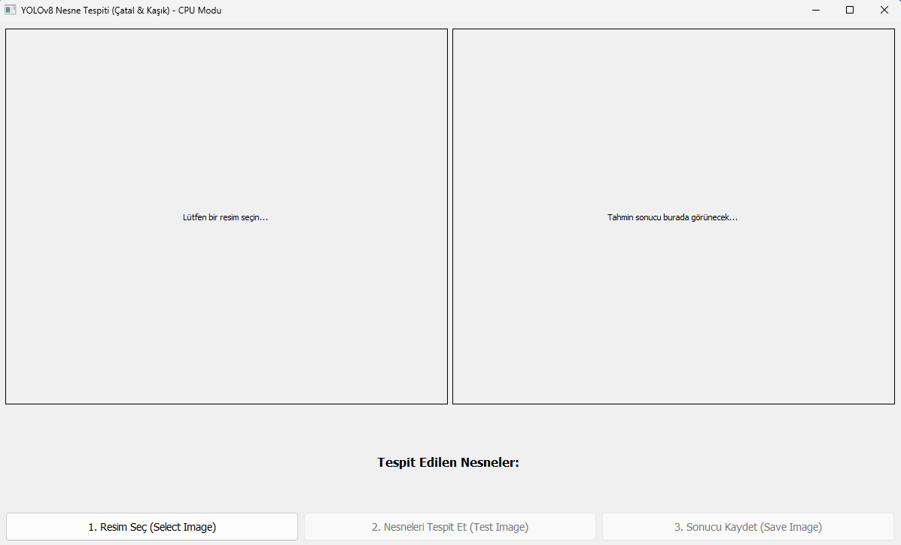
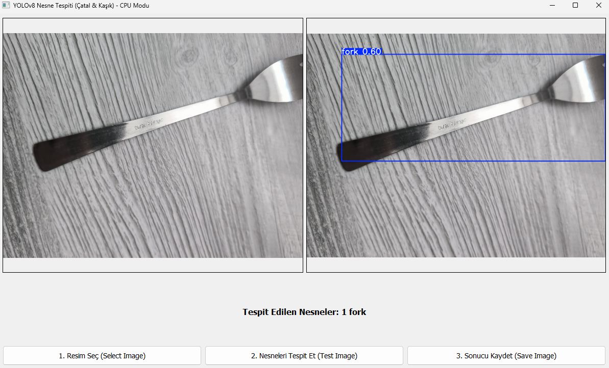
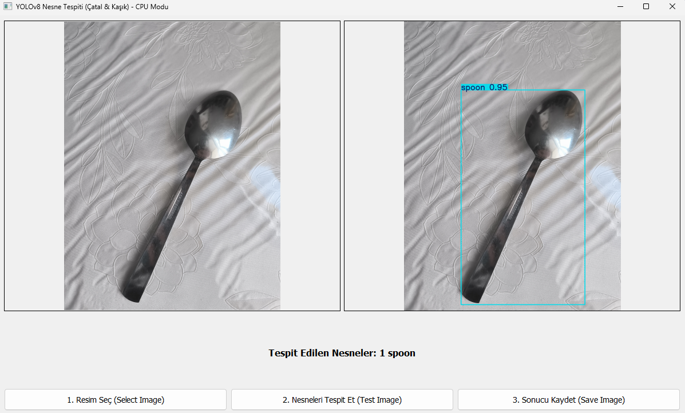
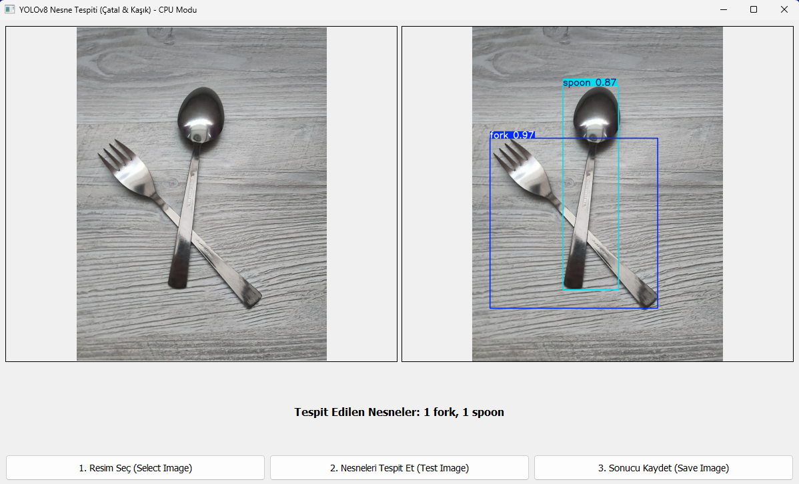

# BLG-407 Proje 2: YOLOv8 ile Çatal/Kaşık Tespiti ve PyQt5 Arayüzü

Bu proje, **BLG-407 Makine Öğrenmesi** dersi kapsamında, "çatal" (fork) ve "kaşık" (spoon) sınıflarını içeren özel bir veri setiyle **YOLOv8** nesne tespiti modeli eğitmeyi ve bu modeli **PyQt5** masaüstü arayüzü ile kullanmayı amaçlar.

## 📋 Proje Bilgileri

| Bilgi | Değer |
|-------|-------|
| **Öğrenci** | İbrahim Kahraman |
| **Okul No** | 2212729009 |
| **Ders** | BLG-407 Makine Öğrenmesi |
| **Dönem** | 2024-2025 Güz |

---

## 📁 Proje Yapısı

```
YoloV8_Object_Detection/
├── yolo_training.ipynb    # YOLOv8 eğitim notebook'u
├── gui_app.py             # PyQt5 arayüz uygulaması
├── best.pt                # Eğitilmiş model ağırlıkları
├── data.yaml              # Veri seti konfigürasyonu
├── requirements.txt       # Python bağımlılıkları
├── train/                 # Eğitim verileri
│   ├── images/
│   └── labels/
├── valid/                 # Validasyon verileri
│   ├── images/
│   └── labels/
├── test/                  # Test verileri
│   ├── images/
│   └── labels/
├── runs/detect/val/       # Model değerlendirme çıktıları
└── assets/                # README görselleri
```

---

## 🗂️ Veri Seti

### Veri Seti Detayları

| Özellik | Değer |
|---------|-------|
| **Toplam Görüntü** | 370+ adet |
| **Sınıf Sayısı** | 2 (fork, spoon) |
| **Etiketleme Aracı** | Roboflow |
| **Format** | YOLOv8 uyumlu (txt) |
| **Görüntü Boyutu** | 512x512 piksel |
| **Kaynak** | Kendi çektiğim fotoğraflar |

### Veri Seti Dağılımı
- **Eğitim (train):** ~280 görüntü
- **Validasyon (valid):** ~50 görüntü  
- **Test (test):** ~40 görüntü

### Ön İşleme
- Otomatik yönlendirme (EXIF düzeltme)
- 512x512 boyutuna yeniden boyutlandırma
- Gri tonlama (CRT phosphor)

### Veri Artırma (Augmentation)
- %50 yatay çevirme
- %50 dikey çevirme
- ±15% parlaklık ayarı
- ±10% pozlama ayarı
- Salt & pepper gürültüsü

---

## 🤖 Model Eğitimi

### Model Mimarisi

| Özellik | Değer |
|---------|-------|
| **Model** | YOLOv8n (nano) |
| **Katman Sayısı** | 72 |
| **Parametre Sayısı** | 3,006,038 |
| **GFLOPs** | 8.1 |

### Eğitim Parametreleri

| Parametre | Değer |
|-----------|-------|
| **Epoch** | 50 |
| **Görüntü Boyutu** | 640x640 |
| **Batch Size** | 16 |
| **Optimizer** | AdamW |
| **Learning Rate** | 0.01 (başlangıç) |
| **Device** | CPU |

### Eğitim Ortamı

| Özellik | Değer |
|---------|-------|
| **İşlemci** | AMD Ryzen 7 6800H |
| **RAM** | 16 GB |
| **Python** | 3.13.7 |
| **PyTorch** | 2.9.1+cpu |
| **Ultralytics** | 8.3.228 |
| **Eğitim Süresi** | ~1.25 saat |

---

## 📊 Model Performansı

### Validasyon Sonuçları

| Sınıf | Görüntü | Örnek | Precision | Recall | mAP50 | mAP50-95 |
|-------|---------|-------|-----------|--------|-------|----------|
| **Tümü** | 49 | 58 | **0.998** | **0.972** | **0.993** | **0.902** |
| fork | 28 | 28 | 0.996 | 0.964 | 0.991 | 0.902 |
| spoon | 30 | 30 | 1.000 | 0.979 | 0.995 | 0.901 |

### Metrik Özeti

| Metrik | Değer | Açıklama |
|--------|-------|----------|
| **mAP50-95** | %90.2 | Genel başarı metriği |
| **mAP50** | %99.3 | IoU=0.5'te doğruluk |
| **Precision** | %99.8 | Kesinlik oranı |
| **Recall** | %97.2 | Duyarlılık oranı |

### Model Değerlendirme Grafikleri

#### Confusion Matrix (Karışıklık Matrisi)
Modelin sınıf bazında tahmin performansını gösterir:


#### Normalized Confusion Matrix
Normalize edilmiş karışıklık matrisi:


#### Precision-Recall Eğrisi
Precision ve Recall arasındaki dengeyi gösterir:


#### F1-Confidence Eğrisi
F1 skorunun confidence eşiğine göre değişimi:


#### Precision-Confidence Eğrisi
Precision değerinin confidence eşiğine göre değişimi:


#### Recall-Confidence Eğrisi
Recall değerinin confidence eşiğine göre değişimi:


### Validasyon Örnekleri

#### Gerçek Etiketler (Ground Truth)


#### Model Tahminleri (Predictions)


## Kurulum (Windows - Lokal)

Bu proje, PyTorch 2.9+ sürümlerinde görülen `OSError: [WinError 1114]` DLL hatasına takılmamak için **Python 3.11** ve **PyTorch 2.8.0 (CPU-Only)** ile geliştirilip test edilmiştir.

### Adım 1: Projeyi Klonlayın

```powershell
git clone https://github.com/ibrahimkahramann/YoloV8_Object_Detection.git
cd YoloV8_Object_Detection
```

### Adım 2: Sanal Ortam Oluşturun (Python 3.11)

```powershell
py -3.11 -m venv venv
```

### Adım 3: Sanal Ortamı Aktifleştirin

```powershell
.\venv\Scripts\Activate.ps1
```

### Adım 4: Bağımlılıkları Kurun

```powershell
pip install -r requirements.txt
```

> ⚠️ **Önemli:** CPU-only PyTorch kurulumu için:
> ```powershell
> pip install torch torchvision torchaudio --index-url https://download.pytorch.org/whl/cpu
> ```

---

## 🚀 Kullanım

### GUI Uygulamasını Çalıştırma

Sanal ortam aktifken terminale aşağıdaki komutu yazın:

```powershell
python gui_app.py
```

### Uygulama Özellikleri

| Buton | İşlev |
|-------|-------|
| **1. Resim Seç** | Bilgisayardan çatal/kaşık fotoğrafı seçme |
| **2. Nesneleri Tespit Et** | YOLOv8 modelini çalıştırıp bounding box çizme |
| **3. Sonucu Kaydet** | İşlenmiş görüntüyü diske kaydetme |

### Arayüz Panelleri

- **Original Image:** Kullanıcının seçtiği orijinal görsel
- **Tagged Image:** Model tarafından analiz edilmiş, bounding box'lı görsel
- **Sonuç Listesi:** Tespit edilen nesnelerin sınıfı ve sayısı

---

## 🖼️ Örnek Arayüz Görüntüleri

### Ana Ekran


### Tespit Örnekleri

| Çatal Tespiti | Kaşık Tespiti | Karma Tespit |
|---------------|---------------|--------------|
|  |  |  |

---

## 📚 Dosya Açıklamaları

| Dosya | Açıklama |
|-------|----------|
| `yolo_training.ipynb` | YOLOv8 model eğitim sürecini gösteren Jupyter Notebook |
| `gui_app.py` | PyQt5 tabanlı masaüstü uygulaması |
| `best.pt` | Eğitilmiş model ağırlıkları |
| `data.yaml` | Veri seti konfigürasyon dosyası |
| `requirements.txt` | Python bağımlılıkları listesi |

---

## 🔧 Sorun Giderme

### WinError 1114 DLL Hatası
Bu hata genellikle GPU destekli PyTorch'un şarjsız dizüstü bilgisayarlarda çalışmamasından kaynaklanır.

**Çözüm:** CPU-only PyTorch kullanın:
```powershell
pip uninstall torch torchvision torchaudio
pip install torch torchvision torchaudio --index-url https://download.pytorch.org/whl/cpu
```

### ModuleNotFoundError
Sanal ortamın aktif olduğundan emin olun:
```powershell
.\venv\Scripts\Activate.ps1
```

---

## 📄 Lisans

Bu proje eğitim amaçlı geliştirilmiştir. Veri seti CC BY 4.0 lisansı altındadır.

---

## 🙏 Teşekkürler

- [Ultralytics YOLOv8](https://github.com/ultralytics/ultralytics) - Nesne tespiti framework'ü
- [Roboflow](https://roboflow.com/) - Veri seti etiketleme aracı
- [PyQt5](https://riverbankcomputing.com/software/pyqt/) - GUI framework'ü 
